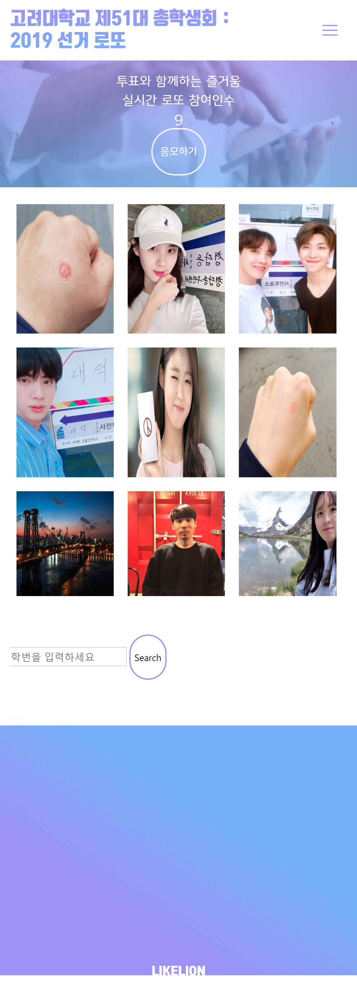

# rails-schoolvote-web
: 총학생회 선거 투표 독려 사이트  (2018 멋사6기 미니톤)  
: 2017 대선에서 투표독려방법으로 국민투표로또 기능이 사용된 것을 아이디어로 삼아 총학생회 버전 사이트를 만듦

- Ruby 2.4.0 / Rails 5.2.1 (sqlite3 -active record)
  + need aws key in application.yml 
  + install imagemagick on Ubuntu 
- mobile layout

### 주요 기능
  - 투표 로또추첨 
     - 학번과 이름으로 본교 학생 여부, 참여 여부 확인
     - 투표인증 사진 업로드
     - 유권자 중 랜덤 추첨
     
  - 공약 블라인드 퀴즈 (js) 
  - 그 외: 후보자 공약 확인, 투표장소 확인 기능 등

### 메인 페이지

